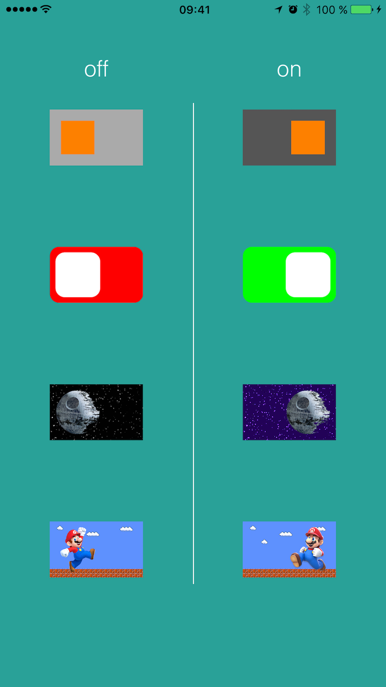
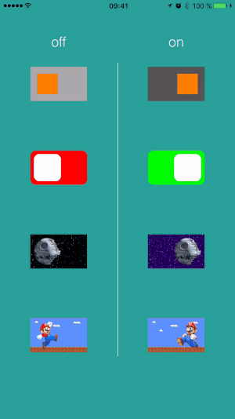

# ORBSwitch [](https://opensource.org/licenses/Zlib) 

ORBSwitch is a simple iOS-style switch with a few customization options:

 * Squared or Rounded Pre-defined styles with colors customization;
 * Custom style supporting any background and switch knob image;
 * Controllable animation events and dynamic property changes;


 

## Usage

### Pre-defined style switch creation

#### Create Square or Round Switch
```objective-c
ORBSwitch *squareSwitch = [[ORBSwitch alloc] initWithType:ORBSwitchSquare frame:CGRectMake(0, 0, 200, 120)];

ORBSwitch *roundSwitch = [[ORBSwitch alloc] initWithType:ORBSwitchRound frame:CGRectMake(0, 0, 200, 120)];
```

#### Set required properties and add switch as subview
```objective-c
switch.knobColor = [UIColor orangeColor];
switch.inactiveBackgroundColor = [UIColor lightGrayColor];
switch.activeBackgroundColor = [UIColor darkGrayColor];

switch.delegate = (id<ORBSwitchDelegate>)self;
[self.view addSubview:switch];
```

<hr>

### Custom style switch creation

#### Set any image for switch knob + background image for both ON and OFF switch states

```objective-c
ORBSwitch *customSwitch = [[ORBSwitch alloc] initWithCustomKnobImage:myKnobUIImage inactiveBackgroundImage:myOffStateBackgroundUIImage activeBackgroundImage:myOnStateBackgroundUIImage frame:CGRectMake(0, 0, 200, 120)];

customSwitch.delegate = (id<ORBSwitchDelegate>)self;
[self.view addSubview:customSwitch];
```

### Universal modifications
#### You can change optional properties for both pre-defined and custom styles
```objective-c
switch.knobRelativeHeight = 0.8f;
```

### Delegate Methods
```objective-c
- (void)orbSwitchToggled:(ORBSwitch *)switchObj withNewValue:(BOOL)newValue {
    NSLog(@"Switch toggled: new state is %@", (newValue) ? @"ON" : @"OFF");
}

- (void)orbSwitchToggleAnimationFinished:(ORBSwitch *)switchObj {
    if (switchObj == _switch4) {
        [switchObj setCustomKnobImage:[UIImage imageNamed:(switchObj.isOn) ? @"mario_l" : @"mario_r"]
              inactiveBackgroundImage:[UIImage imageNamed:@"mario_bg"]
                activeBackgroundImage:[UIImage imageNamed:@"mario_bg"]];
    }
}
```

## ToDo's
+ Document code;
+ Extend customization options;

## License
ORBSwitch is released under the permissive zlib License. See the [LICENSE](https://raw.githubusercontent.com/0xNSHuman/ORBSwitch/master/LICENSE.md) file.
